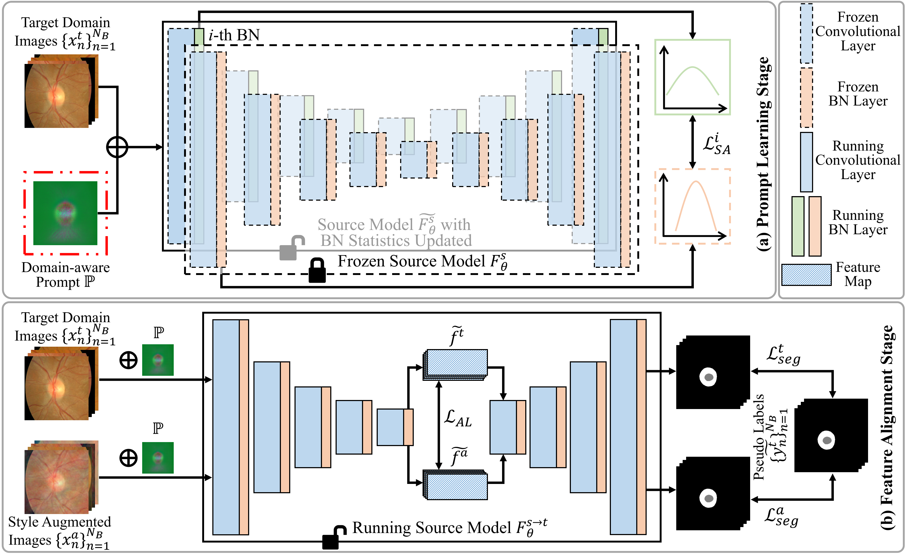

# :page_facing_up: Source-free Domain Adaptation Using Prompt Learning for Medical Image Segmentation (ProSFDA)

<p align="center"></p>

### Data Preparation

You should download the [dataset](https://zenodo.org/record/6325549) and unzip it.

### Dependency Preparation

```shell
cd ProSFDA
# Python Preparation
virtualenv .env --python=3
source .env/bin/activate
# Install PyTorch, compiling PyTorch on your own workstation is suggested but not needed.
# Follow the instructions on https://pytorch.org/get-started/locally/
pip install torch torchvision torchaudio # or other command to match your CUDA version
# Install ProSFDA
pip install -e .
```

### Model Training and Inference

```shell
# Path Preparation
export OUTPUT_FOLDER="YOUR OUTPUT FOLDER"
export RIGAPLUS_DATASET_FOLDER="RIGA+ DATASET FOLDER"

## BinRushed.csv is a merged file of BinRushed_train.csv and BinRushed_test.csv.
## Same as Magrabia.csv, MESSIDOR_Base1.csv, MESSIDOR_Base2.csv, and MESSIDOR_Base3.csv.
## Since the intra-domain training/test data splits are not used under our source-free domain adaptation setting.

# Train Source Model
prosfda_train --model UNet --gpu 0 --tag Source_Model \
--log_folder $OUTPUT_FOLDER \
--batch_size 16 \
-r $RIGAPLUS_DATASET_FOLDER \
--tr_csv $RIGAPLUS_DATASET_FOLDER/BinRushed.csv \
$RIGAPLUS_DATASET_FOLDER/Magrabia.csv \
--ts_csv $RIGAPLUS_DATASET_FOLDER/MESSIDOR_Base1.csv \
$RIGAPLUS_DATASET_FOLDER/MESSIDOR_Base2.csv \
$RIGAPLUS_DATASET_FOLDER/MESSIDOR_Base3.csv

# PLS Using Source Model for Target Domain - BASE1
prosfda_train --model PLS --gpu 0 --tag BASE1 \
--log_folder $OUTPUT_FOLDER \
--batch_size 16 \
--pretrained_model $OUTPUT_FOLDER/UNet_SourceModel/checkpoints/model_final.model \
--initial_lr 0.01 \
-r $RIGAPLUS_DATASET_FOLDER \
--tr_csv $RIGAPLUS_DATASET_FOLDER/MESSIDOR_Base1_unlabeled.csv \
--ts_csv $RIGAPLUS_DATASET_FOLDER/MESSIDOR_Base1.csv # This is the merged file of MESSIDOR_Base1_train.csv and MESSIDOR_Base1_test.csv

# Generate Pseudo Labels for Target Domain - BASE1
prosfda_test --model PLS --gpu 0 --tag BASE1 --inference_tag Base1_unlabeled \
--log_folder $OUTPUT_FOLDER \
-r $RIGAPLUS_DATASET_FOLDER \
--pretrained_model $OUTPUT_FOLDER/UNet_SourceModel/checkpoints/model_final.model \
--ts_csv $RIGAPLUS_DATASET_FOLDER/MESSIDOR_Base1_unlabeled.csv

## Set the path in prosfda/utils/pseudo_label.py, and run it to generate pseudo labels for the target domain - BASE1
python prosfda/utils/pseudo_label.py
## This will generate pseudo labels and a new csv file named 'self-training.csv', 
## you should place the pseudo labels and csv file to the proper path 

## Set the prompt model path, since the learned prompt in the trained PLS model will be used in FAS
export PROMPT_MODEL_PATH="the trained prompt model path in PLS"

# FAS Using Source Model for Target Domain - BASE1
prosfda_train --model FAS --gpu 0 --tag BASE1 \
--log_folder $OUTPUT_FOLDER \
--batch_size 16 \
--pretrained_model $OUTPUT_FOLDER/UNet_SourceModel/checkpoints/model_final.model \
--prompt_model_path $PROMPT_MODEL_PATH\
--initial_lr 0.001 \
-r $RIGAPLUS_DATASET_FOLDER \
--tr_csv $RIGAPLUS_DATASET_FOLDER/$Self_training_csv_path.csv \
--ts_csv $RIGAPLUS_DATASET_FOLDER/MESSIDOR_Base1.csv

# For other target domains, you can run the commands similar to the above commands for BASE1.
```

### Hyperparameter Setting

This section summarizes the key hyperparameter configurations used in our implementation. The settings differ slightly between the PLS and FAS variants of our method.

#### Common Settings
- **Framework**: PyTorch  
- **GPU**: Single NVIDIA 2080Ti  
- **Batch size**: 16  
- **Input size**:
  - OC/OD segmentation: `512 × 512`  
  - GM/WM segmentation: `128 × 128`  
- **Preprocessing**:
  - RIGA+: Center crop to `800 × 800`, then resize to `512 × 512`  
  - SCGM: Resample to `0.25 mm × 0.25 mm` in-plane resolution, then center crop to `128 × 128`  
- **Optimizer**: SGD with momentum `0.99`  
- **Learning rate schedule**: Polynomial decay  
  - `lr = lr_0 × (1 - t / T)^0.9`  
  - `T = 100` epochs  

---

#### 🔵 PLS
- **Initial learning rate**: `0.01`  
- **Data augmentation**: None  
- **Loss weight**:  
  - `α = 0.01` for style-aware loss `𝓛_SA` 

---

#### 🟣 FAS
- **Initial learning rate**: `0.001`  
- **Data augmentation**:
  - Frequency-based style transfer  
  - Basic augmentations: random cropping, rotation, scaling, flipping, Gaussian noise, and elastic deformation  
- **Loss weight**:  
  - `γ = 0.1` for the FAS loss `𝓛_FAS`

---

These settings were used consistently across all domain adaptation experiments. For detailed ablation studies and sensitivity analysis, please refer to the main manuscript.

### Citation ✏️ 📄

If you find this repo useful for your research, please consider citing the paper as follows:

```
@article{hu2022prosfda,
  title={ProSFDA: Prompt Learning based Source-free Domain Adaptation for Medical Image Segmentation},
  author={Hu, Shishuai and Liao, Zehui and Xia, Yong},
  journal={arXiv preprint arXiv:2211.11514},
  year={2022}
}
```
